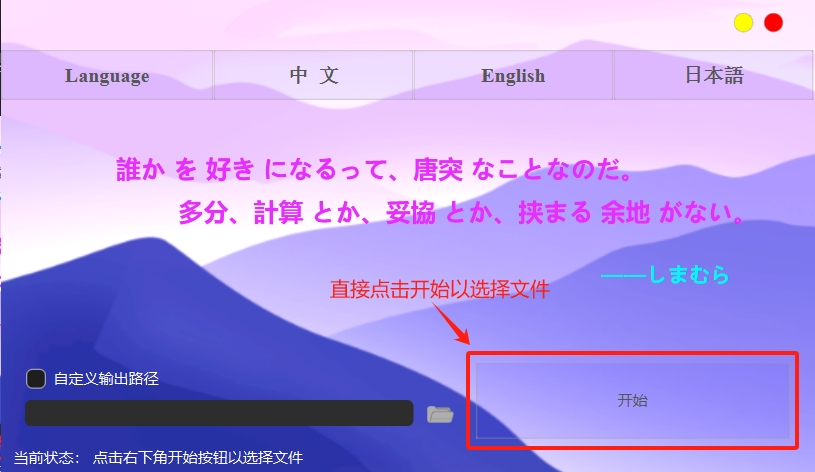

# **kana2epub**
*kana2epub是对日文epub电子书进行汉字振假名标注的软件。选择一个epub文件，程序会生成名为"原文件名+(kana).epub"的epub文件。*
©Copyright 07/27/2024,  雾瑛随风  软件传播时，必须保留源代码。

*标注前*

</img>

*标注后*

</img>

软件特性：
* 保留了原书的全部排版信息，包括封面、目录、图片、文字方向以及缩进等。
* 保留了书中原本就有的振假名，避免了原文某些特定含义的丢失。
* 可对同一文件夹中的epub文件进行批量处理。
* 可自定义的输出路径。

### **基本使用**
1. 双击exe程序进入软件界面。右上红色按钮退出程序，黄色退回任务栏。点击相应的语言按钮可以选择语言。
</img>

2. 根据状态栏提示，点击开始按钮即可进入文件选择对话框。可以选择一个或多个文件。
</img>
</img>

3. 选择epub文件后程序开始运行，大约需要3-15s。视文件大小和数量而定。（此时交互界面不再响应鼠标输入）
</img>

4. 提示音响起，看到状态栏提示转换完成。标注好的文件与原文件路径相同。
</img>
</img>

5. 若想要自定义输出路径，在点击开始前框选自定义按钮，再点击文件图标选择输出目录。
</img>

6. 选择输出目录后同第二步点击开始即可。
